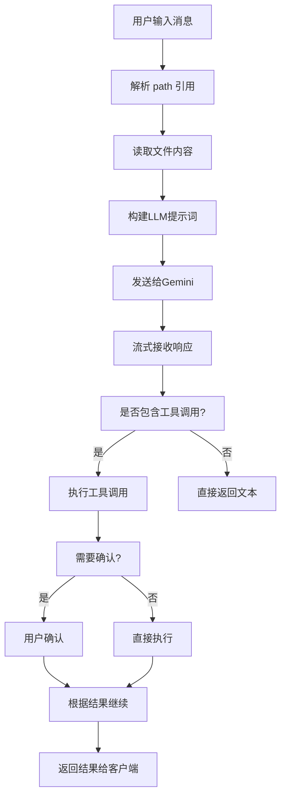
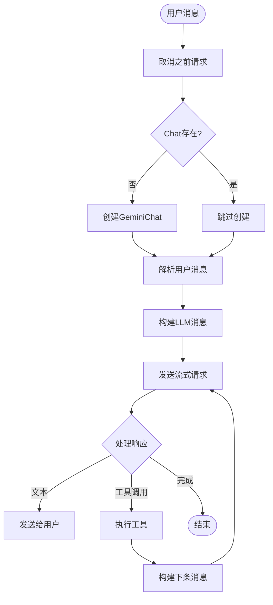
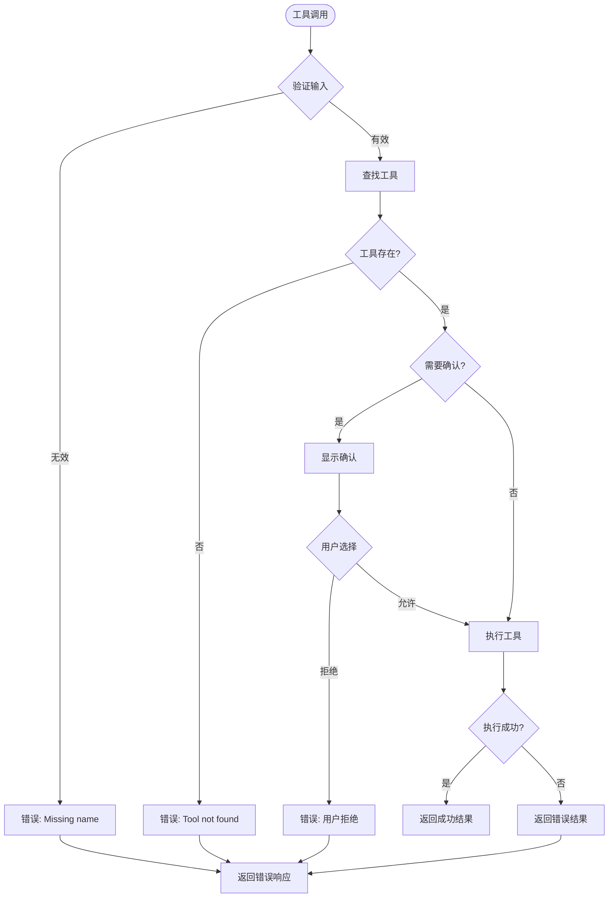
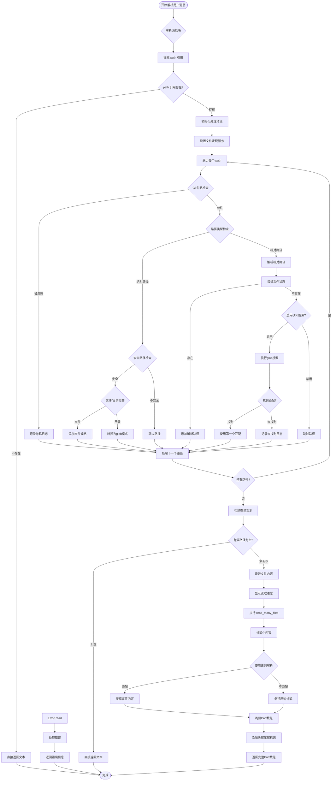

# Gemini CLI 代码解析

---

## 前言

Gemini CLI 已经开源发布了一段时间了，使用了下感觉功能还是很强大的。代码开源也给了我们一个很好的机会来观摩这样一个功能强大的 agent 到底是怎么工作的。简单阅读了一下代码，和大家分享一下所得。水平有限，如有错漏还请各位大佬不吝指出。

## 1. 概述

将 Gemini CLI 代码下载到本地之后我们能发现主要代码分为了 cli 和 core 两部分，cli 中主要是与用户交互和主要业务逻辑调度的部分，core 中则主要是一些底层功能的实现，我们今天主要关注的就是 cli 部分处理核心逻辑的 `packages/cli/src/acp/acpPeer.ts`

`acpPeer.ts` 是 Gemini CLI 中客户端与 Gemini API 之间的核心通信桥梁。该文件包含三个主要组件：

- **入口函数** `runAcpPeer()` - 启动 ACP 连接
- **核心代理类** `GeminiAgent` - 实现 Agent 接口的生命周期管理
- **工具方法** - 支持工具调用和消息处理的辅助函数

---

## 2. 整体架构


### 2.1 核心类结构

```typescript
class GeminiAgent implements Agent {
  // 状态管理
  chat?: GeminiChat;
  pendingSend?: AbortController;

  // 生命周期方法
  initialize(_: InitializeParams): Promise<InitializeResponse>
  authenticate(): Promise<void>
  cancelSendMessage(): Promise<void>
  sendUserMessage(params: SendUserMessageParams): Promise<void>

  // 私有工具方法
  #runTool(abortSignal: AbortSignal, promptId: string, fc: FunctionCall): Promise<PartListUnion>
  #resolveUserMessage(message: SendUserMessageParams, abortSignal: AbortSignal): Promise<Part[]>
  #debug(msg: string): void
}
```

### 2.2 分析
#### 整体架构
主要包含两个核心部分：

- 入口函数 runAcpPeer() - 启动ACP连接的入口点
- GeminiAgent类 GeminiAgent - 实现Agent接口的核心业务逻辑处理器
#### 核心功能模块
1. 通信协议处理层
- 使用Web Streams API处理标准输入输出
- 通过acp.ClientConnection建立客户端连接
- 重定向console输出到stderr避免干扰ACP通信
2. 认证管理模块
- initialize() - 初始化认证状态
- authenticate() - 处理Google登录认证流程
- 支持认证状态刷新和缓存清理
3. 消息处理引擎
- sendUserMessage() - 核心消息处理逻辑
- 实现流式响应处理
- 支持消息取消机制cancelSendMessage()
4. 工具调用系统
- #runTool() - 私有工具执行方法
- 实现工具调用的确认机制
- 支持多种确认类型：编辑、执行、MCP、信息获取
- 完整的错误处理和日志记录
5. 文件内容解析器
- #resolveUserMessage() - 解析用户消息中的文件引用
- 支持@path语法引用文件
- 智能路径解析和glob搜索
- Git忽略文件处理
- 文件内容读取和格式化

#### 业务流程图（其中的path即为用户在cli中通过`@`来引用的文件或目录）



---

## 3. 核心方法详细分析

### 3.1 runAcpPeer - 入口函数

**功能**：建立 ACP 客户端连接  
**输入**：Config 配置对象，LoadedSettings 设置对象  
**输出**：无（建立连接）

```typescript
export async function runAcpPeer(config: Config, settings: LoadedSettings) {
  // 1. 设置标准输入输出流
  const stdout = Writable.toWeb(process.stdout) as WritableStream;
  const stdin = Readable.toWeb(process.stdin) as ReadableStream<Uint8Array>;

  // 2. 重定向控制台输出到 stderr
  console.log = console.error;
  console.info = console.error;
  console.debug = console.error;

  // 3. 建立 ACP 连接
  new acp.ClientConnection(
    (client: acp.Client) => new GeminiAgent(config, settings, client),
    stdout,
    stdin,
  );
}
```

### 3.2 sendUserMessage - 消息处理引擎

**功能**：处理用户消息并生成响应  
**输入**：`SendUserMessageParams` 包含消息块  
**输出**：`Promise<void>`

#### 执行流程图


#### 关键代码
```typescript
async sendUserMessage(params: acp.SendUserMessageParams): Promise<void> {
  // 1. 初始化
  this.pendingSend?.abort();
  const pendingSend = new AbortController();
  this.pendingSend = pendingSend;

  // 2. 解析消息
  const parts = await this.#resolveUserMessage(params, pendingSend.signal);
  let nextMessage: Content | null = { role: 'user', parts };

  // 3. 主循环
  while (nextMessage !== null) {
    const responseStream = await chat.sendMessageStream({
      message: nextMessage.parts,
      tools: toolRegistry.getFunctionDeclarations()
    });

    // 处理响应...
    nextMessage = toolCalls.length > 0 ? { role: 'user', parts: toolResponseParts } : null;
  }
}
```

### 3.3 #runTool - 工具执行器

**功能**：安全执行工具调用  
**输入**：`AbortSignal`, `promptId`, `FunctionCall  `
**输出**：`Promise<PartListUnion>`

#### 执行流程图


#### 关键代码
```typescript
async #runTool(abortSignal: AbortSignal, promptId: string, fc: FunctionCall) {
  // 1. 验证和工具查找
  if (!fc.name) return errorResponse(new Error('Missing function name'));
  const tool = toolRegistry.getTool(fc.name);
  if (!tool) return errorResponse(new Error('Tool not found'));

  // 2. 用户确认
  const confirmationDetails = await tool.shouldConfirmExecute(args, abortSignal);
  if (confirmationDetails) {
    const result = await this.client.requestToolCallConfirmation({...});
    // 处理用户响应...
  }

  // 3. 执行工具
  try {
    const toolResult = await tool.execute(args, abortSignal);
    // 更新UI状态...
    return convertToFunctionResponse(fc.name, callId, toolResult.llmContent);
  } catch (e) {
    return errorResponse(e);
  }
}
```

### 3.4 #resolveUserMessage - 提示词构建器

**功能**：将用户消息转换为LLM可理解的格式  
**输入**：SendUserMessageParams, AbortSignal  
**输出**：Promise<Part[]>

#### 执行流程图（其中的path即为用户在cli中通过`@`来引用的文件或目录）



#### 关键代码
```typescript
async #resolveUserMessage(message: SendUserMessageParams, abortSignal: AbortSignal) {
  // 1. 提取路径引用
  const atPathCommandParts = message.chunks.filter((part) => 'path' in part);
  if (atPathCommandParts.length === 0) {
    return simpleTextConversion();
  }

  // 2. 路径解析
  for (const atPathPart of atPathCommandParts) {
    if (fileDiscovery.shouldGitIgnoreFile(pathName)) continue;
    
    const absolutePath = path.resolve(this.config.getTargetDir(), pathName);
    if (isWithinRoot(absolutePath, this.config.getTargetDir())) {
      // 处理文件或目录...
    }
  }

  // 3. 构建提示词
  let initialQueryText = buildQueryText(message.chunks, pathMappings);
  
  // 4. 读取文件内容
  const result = await readManyFilesTool.execute({
    paths: pathSpecsToRead,
    respectGitIgnore
  });

  // 5. 格式化输出
  return formatContentForLLM(initialQueryText, result.llmContent);
}
```
#### 详细执行步骤
##### 阶段1：输入分析与路径提取（行333-347）
```typescript
// 1. 提取所有 @path 引用
const atPathCommandParts = message.chunks.filter((part) => 'path' in part);

// 2. 快速路径：没有文件引用
if (atPathCommandParts.length === 0) {
  return message.chunks.map((chunk) => {
    if ('text' in chunk) {
      return { text: chunk.text };
    } else {
      throw new Error('Unexpected chunk type');
    }
  });
}
```

##### 阶段2：环境初始化（行349-365）
```typescript
// 获取文件发现服务
const fileDiscovery = this.config.getFileService();
const respectGitIgnore = this.config.getFileFilteringRespectGitIgnore();

// 初始化收集容器
const pathSpecsToRead: string[] = [];           // 要读取的文件规格
const atPathToResolvedSpecMap = new Map<string, string>();  // 路径映射
const contentLabelsForDisplay: string[] = [];   // 显示标签
const ignoredPaths: string[] = [];             // 被忽略的路径

// 获取工具
const toolRegistry = await this.config.getToolRegistry();
const readManyFilesTool = toolRegistry.getTool('read_many_files');
const globTool = toolRegistry.getTool('glob');

```


##### 阶段3：智能路径解析（行366-467）
每个路径的处理流程：

###### 3.1 Git忽略检查
```typescript
if (fileDiscovery.shouldGitIgnoreFile(pathName)) {
  ignoredPaths.push(pathName);
  // 根据配置决定是否跳过
  const reason = respectGitIgnore 
    ? 'git-ignored and will be skipped' 
    : 'ignored by custom patterns';
  console.warn(`Path ${pathName} is ${reason}.`);
  continue;
}
```


###### 3.2 路径安全验证
```typescript
const absolutePath = path.resolve(this.config.getTargetDir(), pathName);
if (isWithinRoot(absolutePath, this.config.getTargetDir())) {
  // 安全检查通过
  const stats = await fs.stat(absolutePath);
  if (stats.isDirectory()) {
    // 目录自动展开为glob模式
    currentPathSpec = pathName.endsWith('/') 
      ? `${pathName}**` 
      : `${pathName}/**`;
  }
}
```


###### 3.3 容错机制 - Glob搜索
```typescript
if (isNodeError(error) && error.code === 'ENOENT') {
  if (this.config.getEnableRecursiveFileSearch() && globTool) {
    const globResult = await globTool.execute({
      pattern: `**/*${pathName}*`,
      path: this.config.getTargetDir(),
    }, abortSignal);
    // 使用第一个匹配的文件
  }
}
```


##### 阶段4：提示词构建（行469-510）
###### 智能文本拼接算法：
```typescript
let initialQueryText = '';
for (let i = 0; i < message.chunks.length; i++) {
  const chunk = message.chunks[i];
  if ('text' in chunk) {
    initialQueryText += chunk.text;
  } else {
    // 处理 @path 引用
    const resolvedSpec = atPathToResolvedSpecMap.get(chunk.path);
    if (resolvedSpec) {
      initialQueryText += `@${resolvedSpec}`;
    } else {
      // 保留原始引用用于错误提示
      initialQueryText += `@${chunk.path}`;
    }
  }
}
```


##### 阶段5：文件内容读取（行520-590）
###### 5.1 执行读取
```typescript
const toolArgs = {
  paths: pathSpecsToRead,
  respectGitIgnore,
};

const toolCall = await this.client.pushToolCall({
  icon: readManyFilesTool.icon,
  label: readManyFilesTool.getDescription(toolArgs),
});

const result = await readManyFilesTool.execute(toolArgs, abortSignal);

```


###### 5.2 内容格式化
使用正则表达式解析文件内容：
```typescript
const fileContentRegex = /^--- (.*?) ---\n\n([\s\S]*?)\n\n$/;
processedQueryParts.push({
  text: '\n--- Content from referenced files ---',
});

for (const part of result.llmContent) {
  if (typeof part === 'string') {
    const match = fileContentRegex.exec(part);
    if (match) {
      const filePathSpecInContent = match[1];
      const fileActualContent = match[2].trim();
      processedQueryParts.push({
        text: `\nContent from @${filePathSpecInContent}:\n`,
      });
      processedQueryParts.push({ text: fileActualContent });
    }
  }
}

processedQueryParts.push({
  text: '\n--- End of content ---',
});

```


#### 关键数据流
##### 输入到输出的转换
```
用户消息块
├── 文本块 → 直接保留
├── @path块 → 路径解析 → 文件读取 → 内容注入
└── 无效路径 → 保留原始引用用于错误提示
```


##### 路径解析映射
```
用户输入 @src/main.ts
    ↓
解析为绝对路径 /project/src/main.ts
    ↓
安全检查 ✓
    ↓
读取文件内容
    ↓
格式化为 LLM 提示词
```

#### 错误处理策略
##### 多层容错机制
- 路径解析错误：使用glob搜索作为后备
- 文件不存在：保留原始引用，LLM可以提示用户
- 权限问题：记录警告但不中断流程
- Git忽略：根据配置决定是否包含
##### 用户反馈机制
- 忽略路径警告：告诉用户哪些文件被跳过
- 无效路径提示：保留原始@引用便于用户修正
- 读取错误展示：在UI中显示具体错误信息
#### 性能优化
##### 并行处理
- 路径解析：多个路径可以并行验证
- 文件读取：通过 read_many_files 工具批量处理
- 内容处理：正则解析和格式化并行执行
##### 内存管理
- 流式处理：避免一次性加载大文件
- 智能截断：超大文件自动截断
- 缓存复用：相同文件内容避免重复读取
#### 输出格式示例
最终构建的提示词结构：
```typescript
[
  { text: "用户原始问题" },
  { text: "\n--- Content from referenced files ---" },
  { text: "\nContent from @src/main.ts:\n" },
  { text: "import express from 'express'..." },
  { text: "\nContent from @package.json:\n" },
  { text: "{\n  \"name\": \"my-app\"\n}" },
  { text: "\n--- End of content ---" }
]
```

这个方法是整个系统的智能提示词引擎，通过多层解析 + 智能容错 + 格式化注入实现了从用户输入到LLM可理解格式的转换。

---


## 7. 使用示例

### 7.1 基本消息处理
```typescript
// 用户输入："请解释这段代码 @src/main.ts"
const result = await agent.sendUserMessage({
  chunks: [
    { text: "请解释这段代码" },
    { path: "src/main.ts" }
  ]
});
```

### 7.2 复杂场景处理
```typescript
// 用户输入："优化这个目录下的所有文件 @src/utils/"
const result = await agent.sendUserMessage({
  chunks: [
    { text: "优化这个目录下的所有文件" },
    { path: "src/utils/" }
  ]
});
// 自动展开为 src/utils/** 并读取所有文件
```

---


## 8. 总结

以上就是 Gemini cli 的主要运行逻辑，可以看到其实大体并不复杂，google 也并没有在其中设置什么特殊的提示词，主要还是依赖基座模型本身的能力。 agent 主要的作用还是为 LLM 来提供合适的工具以及上下文。
