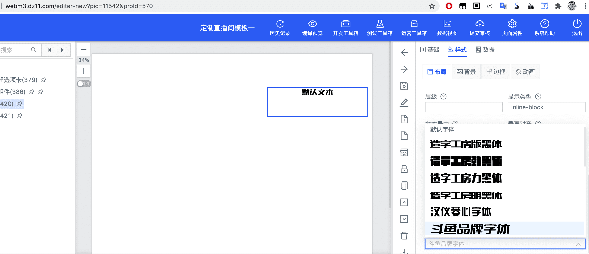
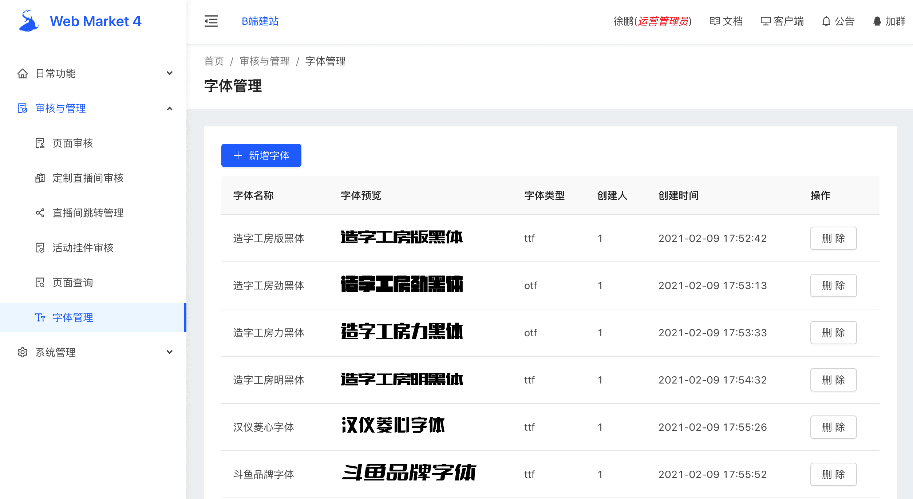
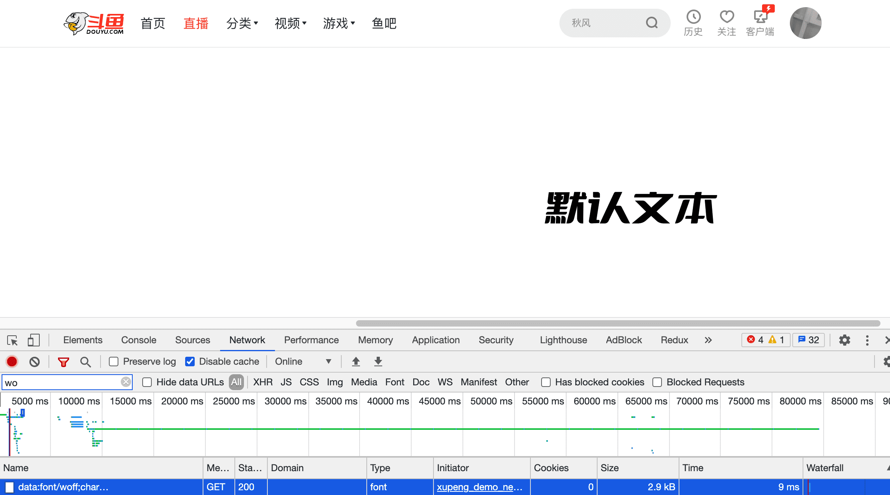
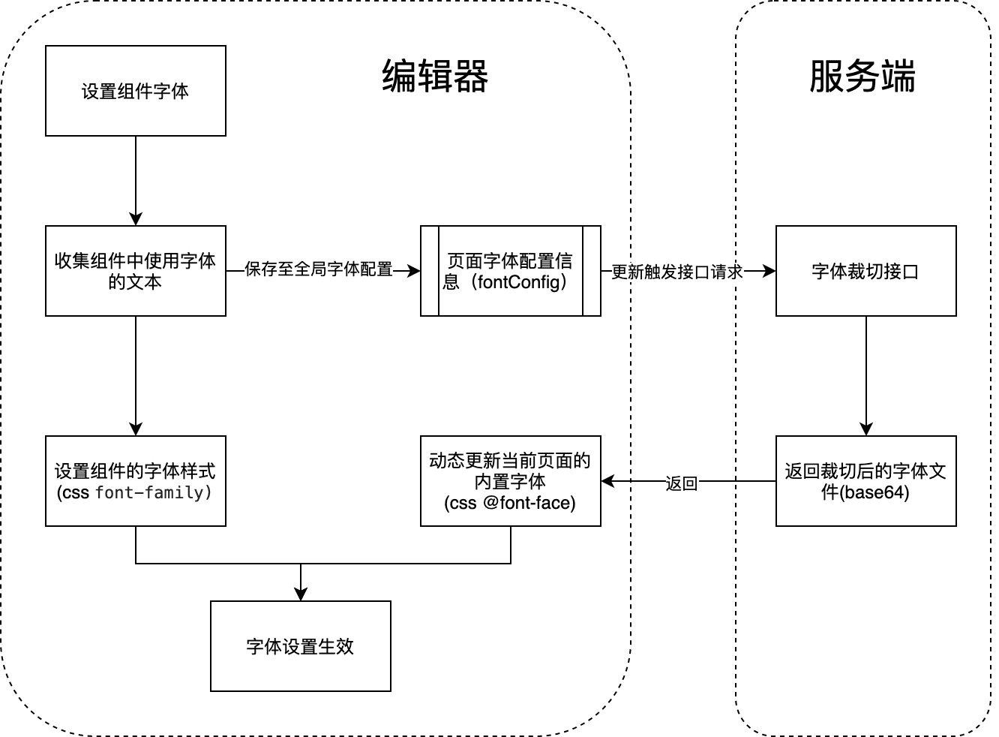

## 输出成果展示

### webm系统中文本组件可选用公司版权字体

功能见下图





### webm平台增加字体管理功能
功能见下图，通过该功能可方便的管理系统中可使用的字体文件，并可实时预览字形



### 最终输出页面中字体文件体积较小，基本无额外资源负担

裁切后的字体为base64编码预置到对应的专题页html模板中，整体体积较小，性能基本无影响。下图示例中字体文件体积仅为2.9k（经gzip后传输体积还会进一步缩小）。




## 实现原理简介

### 服务侧

#### 字体裁切接口

``` javascript 
  /**
   * 根据传入的字体名称和需要应用该字体的文本内容生成裁切后的字体
   * @param {string} fontName 字体名称
   * @param {string} charSubset 需要应用该字体的文本内容（去重）
   */
  async getFont(fontName, charSubset) {
      ...
  }
``` 


#### 根据制定字体和文字生成svg
该功能主要用于字体的字形预览，如字体管理中的“字体预览”列，以及选择字体下拉菜单中的实时预览。
``` javascript 
  /**
   * 根据传入的字体名称和需要应用该字体的文本内容直接生成svg
   * @param {string} fontName  字体名称
   * @param {string} content  需要使用该字体显示的文本内容
   */
  async getSvg(fontName, content) {
      ...
  }
``` 

### 端侧

#### 编辑阶段

``` 
// model
// fontConfig用于保存当前页面所有使用到特定字体的相关信息
const fontConfig = {
	'字体名称1': [
    	{ '组件id1': '组件中需要用到字体的文本内容'},
        { '组件id2': '组件中需要用到字体的文本内容'},
    ],
    '字体名称2': [
    	{ '组件id1': '组件中需要用到字体的文本内容'},
        { '组件id2': '组件中需要用到字体的文本内容'},
    ]
} 
``` 





### 编译阶段

根据页面配置中的fontConfig设置，逐一调用字体裁切接口，获取裁切后的字体，并植入html模板中。

### 运行时

基于模板中的内置的字体（css @font-face）以及对应组件上的字体设置（css font-family），字体成功显示。


