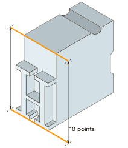

## 前言

近期由于开发了一个和字体有关的功能，开发和查阅文档的过程中有一些新的知识收获，记录下来和大家分享一下

## 一、什么是字体？

在字体排印学中，字体（英语：typeface）是由一个或多个字型组成的集合，每个字型由具有共同设计特徵的字形组成。字体的每一种字型都有特定的字重（weight）、风格（style）、宽度（width）、倾斜度（slant）、斜体（italicization）、装饰（ornamentation）、设计师或铸字厂。例如，「ITC Garamond Bold Condensed Italic」是指ITC Garamond的粗体、紧缩、意大利体版本。它与「ITC Garamond Condensed Italic」与「ITC Garamond Bold Condensed」不是同一个字型，但同属于「ITC Garamond」这个字体。ITC Garamond与「Adobe Garamond」或「Monotype Garamond」是不同字体。（这些都是最初创建于16世纪的Garamond字体的替代更新或数码化。）世界上有成千上万种不同的字体，新的字体也在不断地发展。

每个字体都是若干字形（glyph）的集合，每个字形代表一个字母、数字、标点符号或其他符号。相同的字形可用于不同文字的字符，例如罗马大写字母A看起来与西里尔字母大写字母А和希腊大写字母alpha相同。有专门为特殊应用而设计的字体，如地图製作或占星术和数学。

字体经常与字型混淆。在数字印刷术和桌面出版出现之前，这两个术语的含义更为明确。

「字形」（glyph）指单个字（字母、汉字、符号等）的形体。意思相同的字也可能用到不同字型（如汉字中的正体字与简化字）。

> 所谓「字体」（typeface；也称font family）与「字型」（font），都是排印学与书法领域的专有名词。无论港澳台、中国大陆还是欧美等国非专业普通人士都无法区分作为专业名词的「字体」（typeface）与「字型」（font）。font是指某套具有同样样式、尺寸的字形，如「12号常规明体字」；typeface则是一或多个含有共通设计要素的，包括罗马正体和意大利斜体等的font在一或多个尺寸的集合，具有同一种特定的风格。
>
> 各个中文使用地区对于typeface和font没有通用的翻译。中国大陆国家标准（GB/T 16964.1-1997，为国际标准的官方翻译）将typeface译为「字体名称」，font译为「字型」。[1]台湾专业人士也将typeface译为「字体」。[2]一般可将typeface译为「字体」，font译为「字型」。
>
> 篆书、隶书、楷书、草书、明体、仿宋体、黑体等分别是某类相似风格（其中非印刷、书法类风格也称「书体」）的许多个字体的集合，而不是一种字体。两位书法家写出来的楷书就可称为两种字体；明体在电脑上就有中易宋体和新细明体等字体。
>
> 20世纪90年代前后，储存于电脑上的字形数据库逐渐约定俗成地被英语使用者称为「computer font」，虽然「font」在排印学与书法领域的原意和这里所用的并不是非常吻合。对于「computer font」中的「font」，中国大陆和台湾香港翻译不同，分别为计算机「字体」和电脑「字型」。随着可缩放的向量电脑字型的出现，「字型」与「字体」之间的界限也逐渐模糊。

## 二、字体相关的重要概念

### 1. 衬线（Serif）
一些字体中的字母笔画首尾具有装饰性的细节，称为衬线。具有衬线的字体称为衬线体，不具有衬线的字体称为无衬线体。

### 2. 宽度比例（Proportion）
**比例字体**（proportional typeface）字形的宽度富有变化，**等宽字体**（定宽字体）中的字形具有相同的宽度。一些字体中，西文字母为等宽，而符号和汉字等正好是西文的两倍宽这类字体称为duospaced字体，在中文语境下往往也被称作等宽字体

> 下图中上方为比例字体，下方为等宽字体

### 3. 字体度量（Metric）
对于拉丁字母、希腊字母、西里尔字母等西文字母，基线（**Baseline**）指的是多数字母排列的基准线，通常为 n, x, h 等字母的下沿所在的横线。x, u, w 等字母上沿所在的横线称为主线（**mean line**），其与基线距离称为x字高（**x-height**）。基线以下的垂直空间称为降部（**descender**）；主线到以上的垂直空间称为升部（**ascender**）。一些字母的变音符号位于降部和升部中。升部高度与x字高的比例会对字体的可读性和外观影响很大，并常常用于表徵某一字体。

在电脑字体产生后，字体的度量有了更技术性的定义。将文档中的一种字体改为另一种，如果所有字母的位置都不会变动，则称这两种字体「度量相同」（enmetrically identical）或「度量兼容」（enmetrically compatible）。当前已经有多组度量兼容地字体，可以互相替换而不破坏文档排版，如免费和开源Liberation系列和Croscore系列可以代替一些Microsoft版权所有的字体，以用于后者不允许使用的场合。

### 4. 在浏览器语境下的字体度量
**baseline (基线)**: 分隔 ascent 和 descent ，默认字符底端沿 baseline 排列，如图中的P，x，Ё(为俄文字符)。

**ascent (上升)**: 基线的上部分，字符最高处与 ascent 顶端可能有空白，由 font-family 决定。

**descent (下降)**: 基线的下部分，字符最低处与 descent 底端可能有空白，由 font-family 决定。

**xHeight (X 字高)**: 小写字符 x 的高度，由 font-family 决定。

**capHeight (顶面高度)**: 大写字符 P 的高度，由 font-family 决定。

**lineSpacing (行间距)**: 在浏览器中一般 lineSpacing = ascent + descent。

**lineHeight (行高)**: 默认等于 lineSpacing（多数常见字体的这个值为字体大小的1.2倍）

**half-leading (半行距)**: 如果lineHeight > lineSpacing，则lineHeight 与 lineSpacing 之间会产生上下相等的空隙 (lineHeight - lineSpacing)/2 称为半行距（half-leading或 half lead strips）。

### 5. 其他重要概念

**EM Square**：字体中的EM Square==与css中的em单位不同==，该概念来源于传统的印刷排版 — 也被称作“EM size”或者“UPM”。在一个字体中，每个字符都放置在其空间容器内。在传统的金属字模中，这个容器就是每个字符的实际金属块。每个字符的高度是统一的，这样每个字模可以整齐地放进行和块中（如下）。

字模的高度被称为“em”，起源于大写的字符“M”的宽度；这个字母的比例被做成了方形（因此有了“EM Square”的称呼）。em size是根据字模计算出的点值。因此一个10磅的字体em也是10磅（如下）。
> 传统排版印刷中1磅 = 1points = 1/72 英寸

更多字体相关的概念可以参看这里： http://designwithfontforge.com/zh-CN/What_Is_a_Font.html

fontforge 是很有用的字体工具，如果想深入理解字体的工作原理，建议安装一个看看自己本机字体的相关属性

> 本文参考来源：
>
>  https://zh.wikipedia.org/wiki/%E5%AD%97%E4%BD%93
