## 前言

如果大家在开发过程中常常遇到设置行高以及需要在行内垂直居中的场景，一定会发现有时这两个属性表现出来的效果和预期不太一样。本章将深入探讨这两个常用但是又经常被忽视的css属性：line-height 和 vertical-align，内容中用到了很多第一章中提到的概念，如果有不理解的地方可以对照[第一章](./（一）关于字体，你需要知道的重要概念.md)来阅读。

示例中使用的字体文件我已上传到附件中，有兴趣的同学可以自己下载来研究。文中使用到的FontForge工具可以在[这里](https://fontforge.org/en-US/)下载
> 本章的接下来的主要内容来源于：[https://iamvdo.me/en/blog/css-font-metrics-line-height-and-vertical-align](https://iamvdo.me/en/blog/css-font-metrics-line-height-and-vertical-align) 有兴趣的同学可以参看原文

## 深入理解 line-height 和 vertical-align

line-height 和 vertical-align 都是简单的 CSS 属性，以致于大多数人自以为知道这两个属性的工作原理。但实际上这两个属性非常复杂，也许算得上是 CSS 里最难的两个属性，因为这两个属性和 CSS 里一个鲜为人知的特性息息相关：内联格式化上下文（IFC）。

举例来说，line-height 的值可以是一个长度（length）或者是一个数字，它的默认值是 normal。那么，normal 是什么呢？我们经常将 normal 理解为 1，或者 1.2，甚至连 CSS 规格文档都没有提到这一问题。我们知道 line-height 的值为数字时，表示的相对于 font-size 的倍数，但问题在于，font-size:100px 对应的文字在不同字体里的高度是不一样的！那么 line-height 会随着文字大小的改变而改变吗？ normal 真的表示 1 或者 1.2 吗？vertical-align 又是如何被 line-height 影响的呢？

让我们来深入理解一个不那么简单的 CSS 机制。

### font-size

下面是一段简单的 HTML 代码，一个 p 标签包含了 3 个 span 标签，每个 span 各自有一个 font-family：
>可参见示例页面中的[示例1](http://live.dz11.com/topic/template/testfontcode#exp1)
``` html
// 示例可参看 http://live.dz11.com/topic/template/testfontcode 
<style>
    .exp1  { 
        font-size: 100px; 
    }
    .a { 
        font-family: Arial;
        background-color: red;
    }
    .b { 
        font-family: Gruppo;    
        background-color: red;
    }
    .c { 
        font-family: Catamaran;
        background-color: red;
    }
</style>

<p>
    <span class="a">Ba</span>
    <span class="b">Ba</span>
    <span class="c">Ba</span>
</p> 
``` 

font-size 相同，font-family 不同，得到的 span 元素的高度也不同。

为什么 font-size: 100px 不能得到相同高度的元素呢？我测量了一下每个 span 的高度：Arial 112px，Gruppo 97px，Catamaran 164px。


|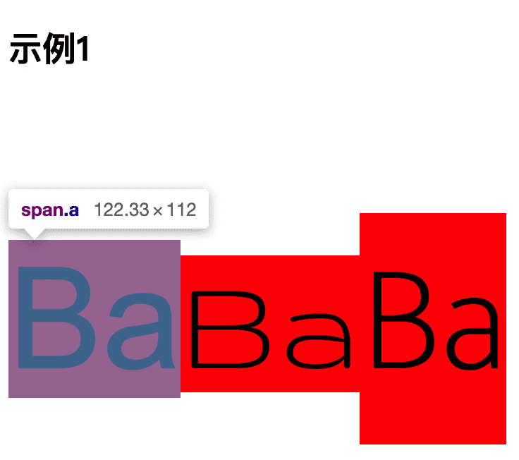|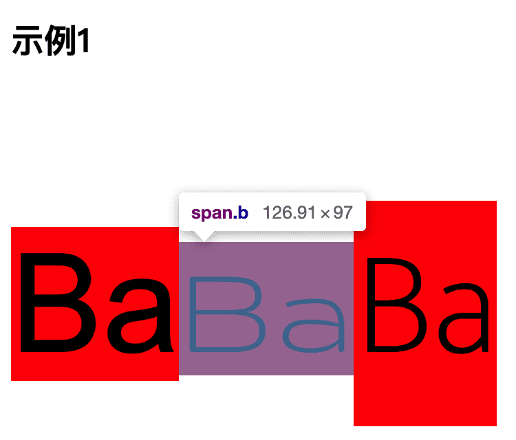|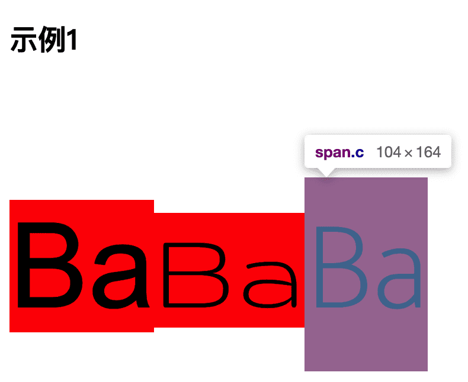|
| :-------------:  |:-------------: |:-------------: |


这个现象看起来很奇怪，但是仔细想想，这么做又是很有道理的。原因在于字体本身，这是字体的原理：

- 一款字体会定义一个 em-square，它是用来盛放字符的金属容器。这个 em-square 一般被设定为宽高均为 1000 相对单位，不过也可以是 1024、2048 相对单位。
- 字体度量都是基于这个相对单位设置的，包括 ascender、descender、capital height、x-height 等。注意这里面的值是允许相对于 em-square 出血（bleed outside）的
- 在浏览器中，上面的 1000 相对单位会按照你需要的 font-size 缩放。

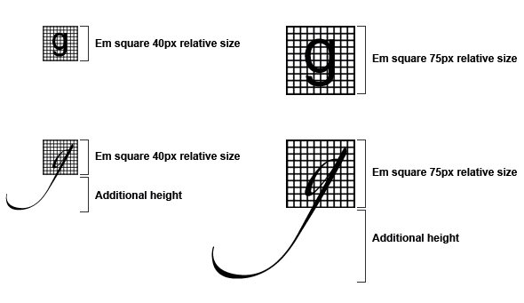

我们来看一下Catamaran字体的度量信息(使用FontForge)
- em-square 是 1000
- ascender 是 1100，descender 是 540(通过测试发现，macOS 上的浏览器使用了 HHead Ascent 和 HHead Descent 值，Windows 上的浏览器使用了 Win Ascent 和 Win Descent)。我们还可以看到 Capital Height 是 680，X height 是 485。

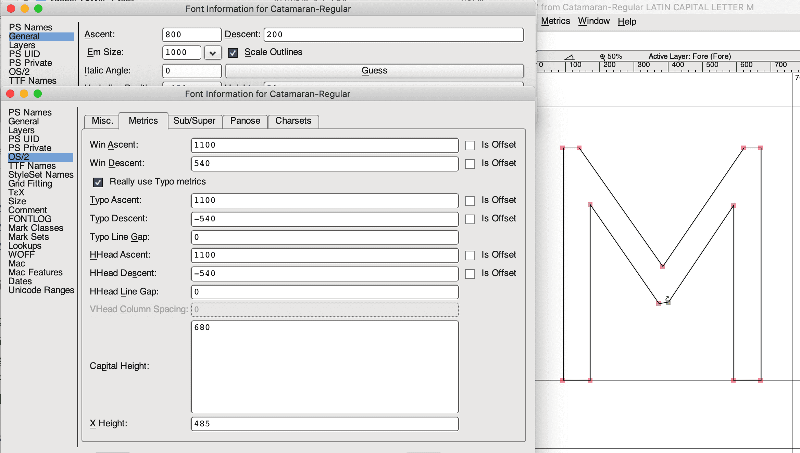

这意味着 Catamaran 字体占据了 1100 + 540 个相对单位，尽管它的 em-square 只有 1000 个相对单位，所以当我们设置 font-size:100px 时，这个字体里的文字高度是 164px（也就是我们上面测量得到的值）。这个计算出来的高度决定了 HTML 元素的 content-area（内容区域），后面我们会讲到 content-area。可以认为 content-area 就是 background 作用的区域（我们在示例中用红色背景标注出来了）。

我们还能看出大写字母的高度是 68px（capHeight），小写字母的高度（x-height）是 49px。所以 1ex = 49px，1em = 100px，而不是 164px。（这里的ex em均为css单位，可以看出em 是基于 font-size，而不是基于计算出来的高度，而ex则与当前所使用的字体以及font-size都有关）


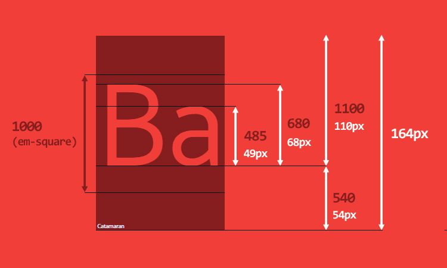

在继续深入之前，说点相关的知识。当 p 元素出现在屏幕上时，它可能包含了多行内容，每行内容由多个内联元素组成（内联标签或者是包含文本的匿名内联元素），每一行都叫做一个 line-box。**line-box 的高度是由它所有子元素的高度计算得出的**。浏览器会计算这一行里每个子元素的高度，再得出 line-box 的高度（具体来说就是从子元素的最高点到最低点的高度），所以默认情况下，一个 line-box 总是有足够的高度来容纳它的子元素。

> 每个 HTML 元素实际上都是由多个 line-box 的容器，如果你知道每个 line-box 的高度，那么你就知道了整个元素的高度。
> 

如果我们修改一下最初的 HTML 代码：

``` html
<style>
    .exp2  { 
        font-size: 100px; 
    }
</style>
<h2>示例2</h2>
<p class="exp2">基准行高</p>
<p class="exp2">
    Good design will be better.
    <span class="a">Ba</span>
    <span class="b">Ba</span>
    <span class="c">Ba</span>
    We get to make a consequence
</p>
``` 

那么在屏幕宽度足够的情况下就会得到 3 个 line-box（见示例页面中的[示例2](http://live.dz11.com/topic/template/testfontcode#exp2)）：
- 第一行和最后一行各有一个匿名内联元素（文本内容）
- 中间一行包含两个匿名内联元素和三个 span

下图为示例2的line-box的分布示意图

我们清楚地看到第二个 line-box 比其他两个要高一些。因为第二行里面的子元素因为有一个用到了 Catamaran 字体的 span。

line-box 的难点在于我们看不见它，而且不能用 CSS 控制它。即使我们用 ::first-line 给第一行加上背景色，我们也看不出第一个 line-box 的高度。
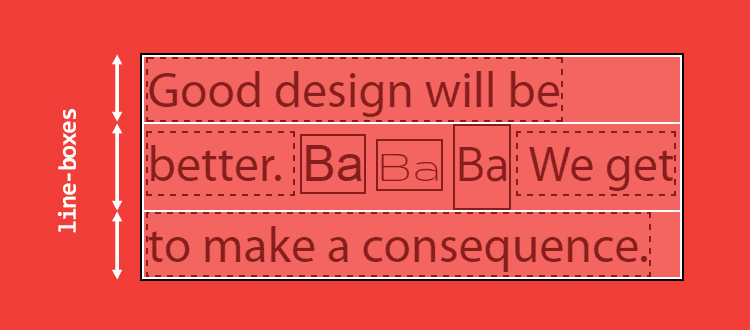

### line-height

终于说到line-height了，上文中提到了两个概念：content-area 和 line-box。line-box 的高度是根据子元素的高度计算出来的，而不是子元素的 content-area 的高度。

一个内联元素有两个高度：content-area 高度和 virtual-area 高度（virtual-area 是原文作者发明的概念，它表示对人类有效的高度，你在其他地方是看不到这个单词的）。

- content-area 的高度是由字体度量定义的（见上文）
- vitual-area 的高度就是 line-height，这个高度用于计算 line-box 的高度


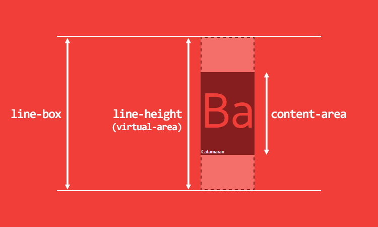

这么一来，这就打破了一个长久的谣言：line-height 表示两个 baseline 之间的距离。在 CSS 里，不是这样的。


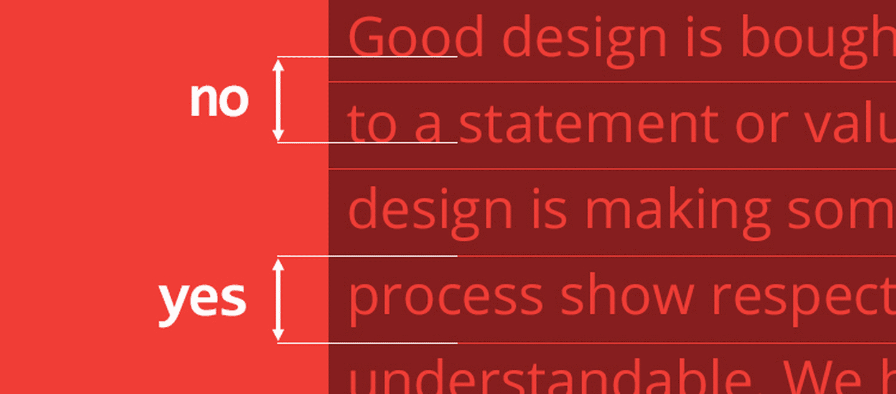

virtual-area 和 content-area 高度的差异叫做 leading。leading 的一半会被加到 content-area 顶部，另一半会被加到底部。因此 content-area 总是处于 virtual-area 的中间。

计算出来的 line-height（也就是 virtual-area 的高度）可以等于、大于或小于 content-area。如果 virtual-area 小于 content-area，那么 leading 就是负的，因此 line-box 看起来就比内容还矮了。

还有一些其他种类的内联元素：

- 可替换的内联元素，如 img / input / svg 等
- inline-block 元素，以及所有 display 值以 inline- 开头的元素
- 处于某种特殊格式化上下文的内联元素（例如 flexbox 元素中的子元素都处于 flex formatting context「弹性格式化上下文」中，这些子元素的 display 值都是「blockified」）

对于这些特定的行内元素，高度计算基于他们的height、margin和border属性。如果hegiht的值是auto，然后使用line-height时content-area严格上等于line-height。


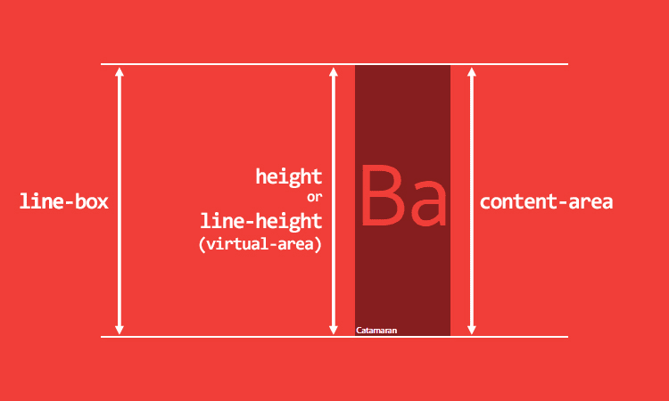

我们目前依然没有解释 line-height:normal 是什么意思。要解答这个问题，我们又得回到 content-area 高度的计算了，问题的答案就在字体度量里面。

我们回到 FontForge，Catamaran 的 em-square 高度是 1000，同时我们还看到很多其他的 ascender/descender 值：


- General 中的 Ascent/Descent：ascender 是 800，descender 是 200，用于渲染字符。
- OS/2 -> Metrics 中的 Ascent/Descent：ascender 是 1100，descender 是 540。用于计算 content-area 的高度
- OS/2 -> Metrics 中的 Line Gap：用于计算 line-height: normal。

在 Catamaran 这款字体中，Line Gap 的值是 0，那么 line-height: normal 的结果就跟 content-area 的高度一样，是 1640 相对单位。

为了对比，我们再看看 Arial 字体，它的 em-square 是 2048，ascender 是 1854，descender 是 434，line gap 是 67。那么当 font-size: 100px 时，

- 其 content-area 的高度就是 100/2048*(1854+434) = 111.72，约为 112px
- 其 line-height: normal 的结果就是 100/2048*(67+1854+434) 约为 115px (此处存疑，在Mac + chrome 环境下测试仍为112px)

所有这些值都是由字体设计师设置的。

这么看来，line-height:1 就是一个很糟糕的实践(当 line-height 的值是一个数字时，其实就是相对 font-size 的倍数，而不是相对于 content-area，所以 line-height:1 很有可能使得 virtual-area 比 content-area 矮，从而引发很多其他的问题。）


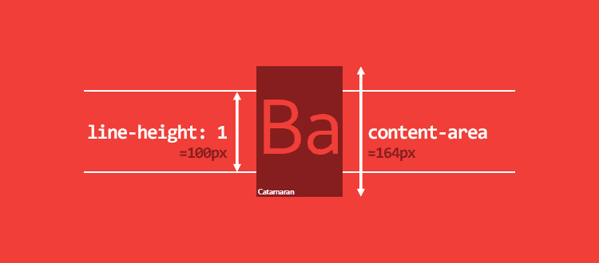

> 不仅仅是 line-height:1 有问题，我电脑上的 1117 款字体中，大概有 1059 款字体的 line-height 比 1 大，最低的是 0.618，最高的是 3.378。你没看错，是 3.378！
> 

line-box 计算的一些细节：

对于内联元素，padding 和 border 会增大 background 区域，但是不会增大 content-area（不是 line-box 的高度）。一般来说你无法再屏幕上看到 content-area。margin-top 和 margin-bottom 对两者都没有影响。
对于可替换内联元素（replaced inline elements）、inline-block 元素和 blockified 内联元素，padding、margin 和 border 会增大 height（译者注：注意 margin），因此会影响 content-area 和 line-box 的高度

### vertical-align
我还没提过 vertical-align 属性，它也是计算 line-box 高度的重要因素之一。我们甚至可以说 vertical-align 是内联格式化上下文（IFC）中最重要的属性。

它的默认值是 baseline。还记得字体度量里的 ascender 和 descender 吗？这两个值决定了 baseline 的位置。很少有

字体的 ascender 和 descender 的比例是一比一的，所以我们经常看到一些意想不到的现象，下面是例子(见示例页面的[示例3](http://live.dz11.com/topic/template/testfontcode#exp3))。


``` html
<style>
    .exp3 {
        font-family: Catamaran;
        font-size: 100px;
        line-height: 200px;
        background-color: red;
        max-width: 300px;
    }  
</style>    

<h2>示例3</h2>
<p class="exp3">
    <span>Ba</span>
    <span>Ba</span>
</p>
``` 
一个 p 标签内有两个 span 标签，span 继承了 font-family、font-size 和 200px 的 line-height。这时两个 span 的 baseline 是等高的，line-box 的高度就是 span 的 line-height。


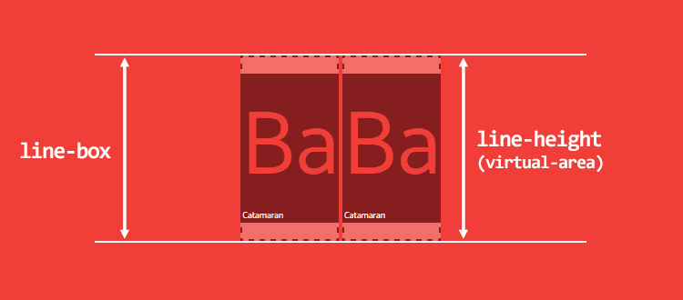

如果第二个 span 的 font-size 变小了呢？

``` html
<style>
    .exp3.part2 span:last-child {
        font-size: 50px;
    }
</style>

<p class="exp3 part2">
    <span>Ba</span>
    <span>Ba</span>
</p>
``` 


我们会发现一个非常奇怪的现象，line-box 的高度变高了！如下图所示。提示你一下，line-box 的高度是从子元素的最高点到最低点来计算的。


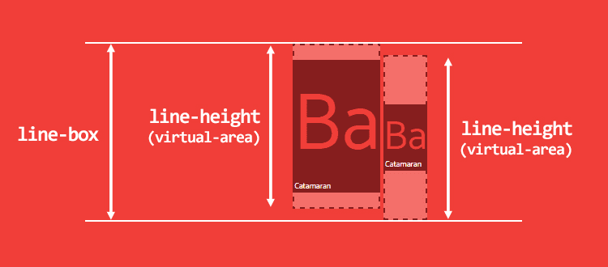

我们来看另一个例子（见示例页面中的[示例4](http://live.dz11.com/topic/template/testfontcode#exp4)）

p 标签有 line-height:200px，内含一个 span，span 继承了 p 的 line-height。


```html 
<style>
    .exp4 {
        line-height: 200px;
    }
    .exp4 span{
        font-family: Catamaran;
        font-size: 100px;
    }
</style>

<h2>示例4</h2>

<p class="exp4">
    <span>Ba</span>
</p>
``` 

此时 line-box 的高度是多少？貌似是 200px，但其实不是。这里你没有考虑到的问题是 ==p 有自己的 font-family，默认值是 serif==。p 的 baseline 和 span 的 baseline 位置不一样，因此最终的 line-box 比我们预想的要高一些。出现这种问题是因为浏览器认为每个 line-box 的起始位置都有一个宽度为 0 的字符（CSS 文档将其称为 strut），并将其纳入 line-box 的高度的计算中。

为了说明这个问题，我们画图解释一下这个问题。


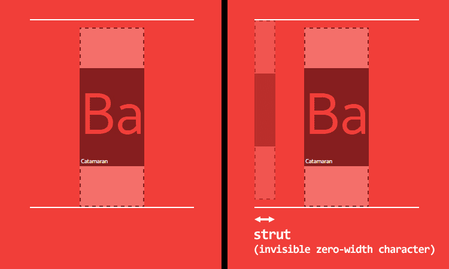

baseline 对齐一堆问题，那 vertical-align: middle 会不会好一点呢？如果你读一下 CSS spec文档，你会发现，middle 的意思是「用父元素 baseline 高度加上父元素中 x-height 的一半的高度来对齐当前元素的垂直方向的中点」。baseline 所处的高度跟字体有关，x-height 的高度也跟字体有关，所以 middle 对齐也同样不可靠。更糟糕的是，大多数情况下，middle 根本就不是居中对齐。内联元素的对齐受太多因素影响（x-height, ascender/descender ratio, 等等等等）基本不可能用 CSS 实现。

vertical-align 的其他 4 个值相对可靠：

- vertical-align: top / bottom，表示与 line-box 的顶部或底部对齐
- vertical-align: text-top / text-bottom，表示与 content-area 的顶部或底部对齐


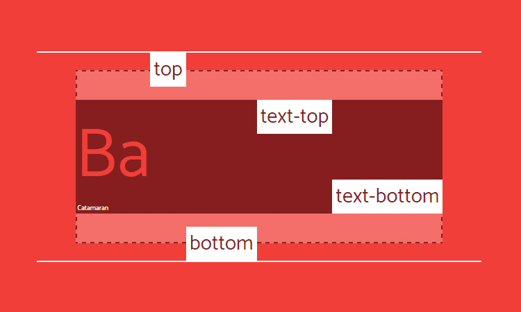

不过你依然要小心，大部分情况下，对齐的是 virtual-area，也就是一个不可见的高度。看看下面这个用 vertical-align:top 的例子：


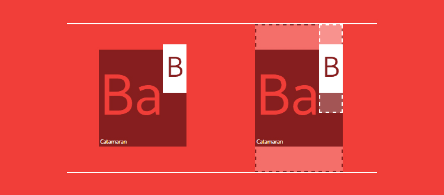

最后，vertical-align 的值也可以是数字，表示根据 baseline 升高或降低，不到万不得已还是别用数字吧。

### 最后玩点花的

我们讨论了 line-height 和 vertical-align 如果互相影响，现在问题来了：CSS 可以控制字体度量吗？简单来说答案是：不行。我也很想用 CSS 来控制字体。无论怎样，我还是想试试。字体度量只是一些固定的值而已，我们应该可以围绕它做点什么。

比如说，我们想要一段文字使用 Catamaran 字体，同时大写字母的高度正好是 100px，看起来可以实现，我们只需要一些数学知识。

首先我们把所有字体度量设置为 CSS 自定义属性，然后计算出一个 font-size，让大写字母的高度正好是 100px。


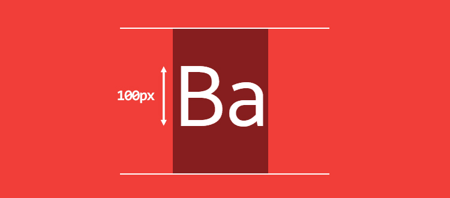

> 见[示例五](https://链接地址.com)，  p元素前方的span刚好是100px高


``` html
<style>
    .exp5 {
        /* font metrics */
        --font: Catamaran;
        --fm-capitalHeight: 0.68;
        --fm-descender: 0.54;
        --fm-ascender: 1.1;
        --fm-linegap: 0;
    
        /* desired font-size for capital height */
        --capital-height: 100;
    
        /* apply font-family */
        font-family: var(--font);
    
        /* compute font-size to get capital height equal desired font-size */
        --computedFontSize: (var(--capital-height) / var(--fm-capitalHeight));
        font-size: calc(var(--computedFontSize) * 1px);
    }
    .s100{
        display: inline-block;
        width: 100px;
        height: 100px;
        background-color: red;
    }
</style>

<h2>示例5</h2>


<p class="exp5">
    <span class="s100"></span>
    <span>Ba</span>
</p>
``` 

再来一点挑战，让文字真正的垂直居中，也就是让 B 上面的空间和下面的空间高度一样。为了做到这一点，我们必须要根据 ascender 和 descender 的比例来计算 vertical-align。

```html
 <style>
    .exp5.part2 {
    	/* 首先计算出 line-height:normal 的值和 content-area 的高度 */
    	--lineheightNormal: (var(--fm-ascender) + var(--fm-descender) + var(--fm-linegap));
		--contentArea: (var(--lineheightNormal) * var(--computedFontSize));
        /* 然后计算B下面空间的高度以及上面空间的高度 */
        --distanceBottom: (var(--fm-descender));
    	--distanceTop: (var(--fm-ascender) - var(--fm-capitalHeight));
        /* 最后可以算出vertical-align的高度 */
        --valign: ((var(--distanceBottom) - var(--distanceTop)) * var(--computedFontSize));
        /* 设置3倍行高，此时p元素高度应该为300px */
        --line-height: 3;
    	line-height: calc(((var(--line-height) * var(--capital-height)) - var(--valign)) * 1px);
    }
    .exp5.part2 span {
    	/* 应用vertical-align */
    	vertical-align: calc(var(--valign) * -1px);
    }
</style>    
``` 

==请注意：这只是为了演示，请不要在生产环境中使用此方案。==


