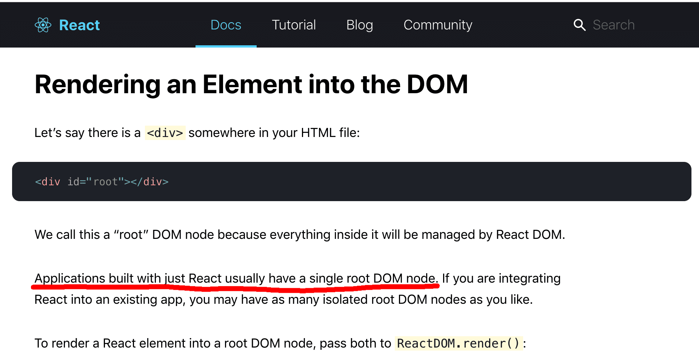

## 史前时代

### Dreamweaver
>Macromedia 公司的伟大作品，当时 Fireworks Flash 一起被并称为网页三剑客。


### Frontpage
>微软公司早期的辣鸡产品，你们童年记忆中那些有着可怕风格的网页多半是这个玩意搭建的


> “烘培鸡”
> 


这些软件就是最早期的可视化搭建工具，搭建的内容是静态网页，也就是Html。

让我们来回顾一下Html的结构


> 从前端开发的角度, 可以认为页面是由 DOM Tree 和 Data 组成, DOM Tree 是页面元素的树形结构, Data 是页面元素的属性或文本节点. 下图中蓝色框所示的节点可以认为是数据.


简单的来说，这些静态页面搭建工具所做的事情，就是把 DOM 元素拖入 DOM Tree中， 然后修改一下他们的属性或者在其中添加文本节点。

如果把CSS的事情先放到一边，再简单一点说，==搭静态页面 = 搭DOM树== 

## 组件时代


### 典型 React 应用

``` 
import React from "react";
import ReactDOM from "react-dom";
import Comp1 from "./Comp1"
import Comp1 from "./Comp2"
import Comp1 from "./Comp3"
import Comp1 from "./Comp4"
import Comp1 from "./Comp5"

import "./styles.css";

function App() {
  return <div>
  	<Comp1 />
    <Comp2>
    	<Comp4 />
        <Comp4 />
    </Comp2>
    <Comp3>
    	<Comp5 />
        <Comp5 />
        <Comp5 />
    </Comp3>
  </div>;
}

const rootElement = document.getElementById("root");

ReactDOM.render(<App />, rootElement);
``` 
 
``` 
<!DOCTYPE html>
<html lang="en">
<head>
	<title>React App</title>
</head>

<body>
	<div id="root"></div>
</body>
<script src="js/app.js"></script>
</html> 
``` 
实际代码 https://codepen.io/dancancer/project/editor/DdOqrb#


### 多根节点？
大部分react教程（包括官方文档）都会有这么一句描述
> 我们用React 开发应用时一般只会定义一个根节点。
> 


那么，如果有多个挂载点会怎样呢？下面我们来看一个例子


``` 
function Comp1() {
  return <div>comp1</div>;
}

function Comp2() {
  return <div>comp2</div>;
}

const comp1Element = document.getElementById("comp1");

const comp2Element = document.getElementById("comp2");

ReactDOM.render(<Comp1 />, comp1Element);

ReactDOM.render(<Comp2 />, comp2Element); 
``` 


``` 
<!DOCTYPE html>
<html lang="en">

<head>
  <meta charset="UTF-8">
  <title>React Demo</title>
 
</head>

<body>

<div id="comp1" style="background-color:red; height:50px; width: 150px"></div>
<div id="comp2" style="background-color:blue; height:50px; width: 150px"></div>

<script src="js/app.js"></script>

</body>

</html> 
``` 
https://codesandbox.io/s/kind-moser-hgxvp

## 如何做组件时代的可视化搭建？

### 组件树 -> 代码

单入口，根据组件树结构生成代码，编译运行

* 阿里飞冰
* vue-layout

### 另外的选择

多入口，根据组件树生成挂载点和层级结构，预编译，动态加载运行


